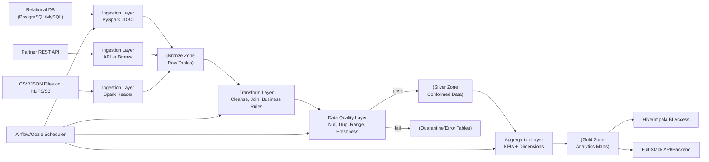

# End-to-End ETL Pipeline (PySpark + Cloudera Data Platform)

This repository provides a **simple but complete ETL project template** that covers:

- Scalable ingestion from databases, APIs, and files.
- PySpark transformation and optimization patterns.
- Data quality checks and validation.
- Loading curated outputs to Hive/HDFS.
- Airflow orchestration (CDP-ready deployment pattern).
- Monitoring, operations checklist, and documentation standards.
- Integration notes for full-stack applications.

---

## 1) Project Goal

Build a maintainable ETL pipeline that ingests customer order data from multiple sources, applies business transformations, validates quality, and publishes trusted analytics-ready datasets.

---

## 2) High-Level Flow Diagram



---

## 3) Step-by-Step Implementation

### Step 1: Configure environments
- Define input/output paths, table names, batch date, and checkpoint locations.
- Externalize secrets (JDBC credentials, API tokens) via environment variables or secret manager.

### Step 2: Build ingestion jobs
- JDBC ingestion for RDBMS tables.
- API ingestion for near-real-time partner data.
- File ingestion for CSV/JSON/parquet drops.
- Persist all raw payloads to **Bronze** with ingestion metadata.

### Step 3: Build transformation logic
- Standardize schemas and data types.
- Handle nulls, malformed records, and duplicate events.
- Join reference/master datasets.
- Apply business rules and derive metrics.

### Step 4: Implement quality checks
- Record count thresholds.
- Null/duplicate key checks.
- Domain/range validation.
- Reconciliation against source totals.

### Step 5: Load curated outputs
- Write partitioned silver/gold datasets.
- Refresh Hive metastore tables.
- Optimize file size and partition strategy.

### Step 6: Orchestrate with Airflow/Oozie
- Build a DAG with retries, SLAs, alerts.
- Parameterize by execution date.
- Capture run metrics and logs.

### Step 7: Monitor and operate
- Track runtime, failed records, skew, and cluster utilization.
- Add dashboards/alerts for late or failed pipelines.
- Define runbooks for restart/reprocess.

---

## 4) Repository Structure

```text
.
├── README.md
├── docs/
│   └── architecture.md
├── conf/
│   └── pipeline.yml
├── dags/
│   └── cdp_etl_dag.py
├── scripts/
│   └── run_local.sh
├── src/
│   └── pipeline/
│       ├── config.py
│       ├── ingestion.py
│       ├── transformation.py
│       ├── quality.py
│       ├── load.py
│       └── job.py
└── tests/
    └── test_quality_rules.py
```

---

## 5) Quick Start

```bash
python -m venv .venv
source .venv/bin/activate
pip install -r requirements.txt
pip install -e .
# Optional (only if you need Airflow extras):
# pip install -e .[airflow]
bash scripts/run_local.sh  # uses --source sample for local demo
```

> For CDP, package `src/` as a deployable artifact and submit via Airflow, Oozie, or Spark submit wrappers.

### Local validation

```bash
PYTHONPATH=src pytest -q tests/test_quality_rules.py
```


### Windows notes

If you are on Windows PowerShell, use:

```powershell
py -m venv .venv
.\.venv\Scripts\Activate.ps1
pip install -r requirements.txt
pip install -e .
python -m pipeline.job --config conf/pipeline.yml --source sample
```

Airflow is optional. Install extras from the package metadata:

```powershell
pip install -e .[airflow]
```


### Common Windows errors

- `ModuleNotFoundError: No module named pipeline`
  - Run `pip install -e .` once in your active virtual environment, then retry `python -m pipeline.job ...`.
- `IndentationError` / `SyntaxError` in `src/pipeline/*.py`
  - This usually indicates a stale or locally edited file that differs from the repository.
  - Re-sync your branch (`git pull`) and verify syntax with:

```powershell
python -m compileall src
```

### Troubleshooting install errors

If you still see `No matching distribution found for apache-airflow==2.9.3`, you are likely using Python 3.13+ with an older cached requirements file.

Use:

```powershell
pip install -r requirements.txt
pip install -r requirements-airflow.txt
```

And verify the file contains both Python-version markers for Airflow.

---

## 6) Optimization Patterns (PySpark + CDP)

1. Prefer DataFrame APIs and built-in SQL functions over Python UDFs.
2. Repartition on high-cardinality join keys before heavy joins.
3. Broadcast small dimension tables.
4. Use partition pruning and predicate pushdown.
5. Right-size executor memory and cores in CDP cluster queues.
6. Compact small files and maintain partition hygiene.

---

## 7) Data Quality and Validation Strategy

- **Schema checks**: expected columns and types.
- **Business rule checks**: valid status, amount > 0, date windows.
- **Integrity checks**: no duplicate business keys.
- **Freshness checks**: latest partition must be within SLA.
- **Quarantine pattern**: failed rows are preserved for remediation.

---

## 8) How This Differs from Normal Full-Stack Development

| Aspect | ETL / Data Engineering | Typical Full-Stack App |
|---|---|---|
| Primary objective | Batch/stream data correctness at scale | User-facing features and UX |
| Data shape | Very large, evolving schemas | Transactional, normalized app data |
| Compute model | Distributed (Spark/Hadoop) | Request/response services |
| Failure handling | Idempotent reruns, checkpoints, reprocessing | Retries, fallbacks, circuit breakers |
| Testing style | Data reconciliation + quality assertions | Unit/integration/API/UI tests |
| Performance tuning | Shuffle, partitioning, skew, file formats | API latency, DB indexes, frontend rendering |
| Operations | SLA windows, backfill strategy, lineage | Deployment cadence, uptime, user incidents |

### Integration with Full-Stack Systems
- Publish gold tables or APIs for backend services.
- Let product/backend teams consume stable data contracts.
- Use event-driven updates (Kafka) for low-latency experiences.
- Align schema evolution with API versioning.

---

## 9) Conclusion

This project gives a practical foundation to build **production-ready ETL on CDP** using PySpark. It includes ingestion, transformation, quality controls, orchestration, and monitoring patterns that scale to enterprise workloads, while also showing how data pipelines integrate with full-stack applications.
